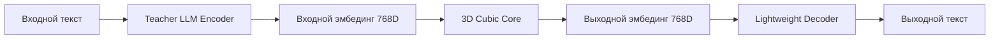

# CONTEXT SUMMARY: Modular Architecture Integration

**Дата обновления:** 6 декабря 2025  
**Текущая сессия:** Модульное переосмысление архитектуры  
**Статус проекта:** 🧠 **МОДУЛЬНАЯ АРХИТЕКТУРА ГОТОВА К РЕАЛИЗАЦИИ**

---

## 🚀 ВЫПОЛНЕНО В ЭТОЙ СЕССИИ

### 📋 Главная задача

Полностью пересмотреть архитектуру проекта в соответствии с новой упрощенной модульной концепцией. Разделить систему на три независимых модуля для значительного упрощения разработки, обучения и тестирования.

### ✅ ЗАВЕРШЕННЫЕ ИЗМЕНЕНИЯ

#### 1. 🎯 Радикальное обновление PROJECT_PLAN.md

- **Новая модульная концепция:** Система разделена на три независимых модуля
- **Упрощенная архитектура:** От сложной революционной к понятной модульной
- **Переработаны все фазы разработки:** Phase 2.3 → 2.5 → 2.7 → 3 → 3.5
- **Обновлена структура модулей:** 12 модулей вместо 15 (упрощение)
- **Новая конфигурация:** YAML settings для модульной архитектуры

#### 2. 📄 Создан детальный план Phase 2.3

- **PHASE_2_3_PLAN.md** - EmbeddingReshaper (1 неделя, критический приоритет)
- **Пошаговый план 7 дней** с четкими checkpoints
- **Технические спецификации** для 1D↔3D конвертации
- **Интеграционные requirements** с существующими модулями

#### 3. 🏗️ Определена модульная архитектура



---

## 🧠 НОВАЯ МОДУЛЬНАЯ АРХИТЕКТУРА

### 🔴 Модуль 1: Teacher LLM Encoder ✅ ГОТОВ

- **Задача:** Текст → Семантический эмбединг (768D)
- **Статус:** Уже реализован в `data/embedding_loader/`
- **Возможности:** 8+ LLM моделей, real-time conversion, smart caching
- **Параметры:** 7B+ (используем готовые модели)

### 🔵 Модуль 2: 3D Cubic Core 🔄 ОСНОВНАЯ РАЗРАБОТКА

- **Задача:** Эмбединг → Обработанный эмбединг (768D → 768D)
- **Компоненты:** EmbeddingReshaper + EmbeddingProcessor + Lattice3D
- **Обучение:** Простые пары (входной*эмбединг, целевой*эмбединг)
- **Параметры:** ~100K-1M (компактный и эффективный)

### 🟡 Модуль 3: Lightweight Decoder 🆕 НОВЫЙ

- **Задача:** Эмбединг → Текст
- **Варианты:** Phrase Bank, Generative, Hybrid подходы
- **Размер:** ~1-2M параметров (против 7B+ у LLM)
- **Фокус:** Компактность и эффективность

---

## 📊 ПРЕИМУЩЕСТВА НОВОЙ АРХИТЕКТУРЫ

### 🎯 Упрощение обучения

```python
# ✅ НОВЫЙ ПОДХОД (простой):
# Куб учится только: эмбединг → эмбединг
loss = cosine_similarity(predicted_embedding, target_embedding)

# ❌ СТАРЫЙ ПОДХОД (сложный):
# Куб учился: эмбединг → текстовые токены → текст
# loss = cross_entropy(predicted_tokens, target_tokens)
```

### 🔄 Модульная замена компонентов

```python
system = CognitiveSystem(
    encoder=LlamaEncoder(),      # Можно заменить на любой
    core=Lattice3D(),           # Наша разработка
    decoder=LightweightDecoder() # Можно заменить на любой
)
```

### 🧪 Независимое обучение модулей

- **Encoder:** Уже обучен (LLaMA)
- **Core:** Обучаем на эмбедингах
- **Decoder:** Обучаем отдельно на реконструкции текста

---

## 📊 ОБНОВЛЕННЫЕ МЕТРИКИ ПРОЕКТА

### Структура проекта

- **Общее количество модулей:** 12 (упрощено с 15)
- **Модулей завершено:** 6/12 ✅
- **Новых модулей:** 6 для модульной архитектуры
- **Фаз разработки:** 5 четко структурированных фаз

### Прогресс разработки

- **Phase 1:** ✅ 100% (Foundation - основа 3D Cubic Core)
- **Phase 2:** ✅ 100% (Data Pipeline - Модуль 1 Teacher LLM Encoder)
- **Phase 2.3:** 🚀 0% (EmbeddingReshaper - критический приоритет)
- **Phase 2.5:** 🔄 0% (Core Embedding Processor - основной фокус)
- **Phase 2.7:** 🟡 0% (Lightweight Decoder - параллельная разработка)
- **Phase 3:** 🎯 0% (Модульное Обучение)
- **Phase 3.5:** 💡 0% (End-to-End Integration)

### Готовность модулей

- **🔴 Модуль 1:** ✅ 100% ГОТОВ (Teacher LLM Encoder)
- **🔵 Модуль 2:** 🔄 20% (основа готова, нужен EmbeddingProcessor)
- **🟡 Модуль 3:** 🆕 0% (новая разработка)

---

## 🎯 СЛЕДУЮЩИЕ ШАГИ

### 🚀 КРИТИЧЕСКИЙ ПРИОРИТЕТ 1: EmbeddingReshaper (1 неделя)

**Phase 2.3 - НЕМЕДЛЕННЫЙ ЗАПУСК:**

- **Цель:** Создать мост между модулями (1D↔3D конвертация)
- **Milestone:** Semantic preservation >95%
- **Значение:** Критически важен для всех последующих модулей

### 🔵 ОСНОВНОЙ ФОКУС 2: Core Embedding Processor (2-3 недели)

**Phase 2.5 - ГЛАВНАЯ РАЗРАБОТКА:**

- **Цель:** Завершить Модуль 2 (3D Cubic Core)
- **Milestone:** Cosine similarity >90% в автоэнкодер режиме
- **Значение:** Сердце всей системы

### 🟡 ПАРАЛЛЕЛЬНАЯ РАЗРАБОТКА 3: Lightweight Decoder (2-3 недели)

**Phase 2.7 - НОВЫЙ МОДУЛЬ:**

- **Цель:** Создать Модуль 3 (компактный декодер)
- **Milestone:** BLEU score >0.4, размер <2M параметров
- **Значение:** Завершение модульной триады

---

## 🛡️ СОХРАНЕНИЕ ПРИНЦИПОВ РАЗРАБОТКИ

### ✅ Принципы соблюдены

- **Экстремальная модульность:** Каждый модуль четко изолирован
- **Инкрементальная разработка:** Детальные checkpoints на каждом этапе
- **Documentation-first:** Phase 2.3 план создан с полной документацией
- **Минимальные изменения:** Каждая фаза имеет четкие критерии завершения
- **Постепенность:** От простого к сложному: 2.3 → 2.5 → 2.7 → 3 → 3.5

### 🎯 Готовность к продолжению

- **EmbeddingReshaper план готов:** Детальный 7-дневный план создан
- **Конфигурация обновлена:** YAML settings для модульной архитектуры
- **API совместимость:** Новые модули интегрируются с существующими
- **Тестирование подготовлено:** Критерии успеха определены

---

## 💡 КЛЮЧЕВЫЕ ДОСТИЖЕНИЯ СЕССИИ

### Архитектурное упрощение

- **Модульная архитектура** полностью спроектирована
- **Упрощенное обучение** - только эмбединг→эмбединг для куба
- **Независимые модули** готовы к параллельной разработке
- **Production-ready roadmap** четко структурирован

### Планирование и документация

- **Детальный план Phase 2.3** создан (7 дней)
- **Технические спецификации** для всех модулей
- **Критерии успеха** определены для каждой фазы
- **Интеграционная стратегия** разработана

### Готовность к реализации

- **EmbeddingReshaper готов к запуску** (критический приоритет)
- **Dependencies mapped** и готовы
- **Configuration files** обновлены
- **Clear development path** установлен

---

## 🧪 ДАННЫЕ И МЕТОДОЛОГИЯ

### Упрощенные обучающие данные

```python
# Модуль 2: Автоэнкодер данные для куба
autoencoder_data = [(embedding, embedding) for text in corpus]

# Модуль 2: Диалоговые данные для куба
dialogue_data = [(question_emb, answer_emb) for (q, a) in pairs]

# Модуль 3: Декодер данные
decoder_data = [(embedding, original_text) for text in corpus]
```

### Метрики качества

- **EmbeddingProcessor (куб):** Cosine similarity >90%
- **LightweightDecoder:** BLEU score >0.4
- **End-to-End система:** Coherence >80%

---

**🎯 СТАТУС: ГОТОВ К PHASE 2.3 - EMBEDDINGRESHAPER**

_Модульная архитектура спроектирована. Проект готов к созданию критически важного моста между модулями._
