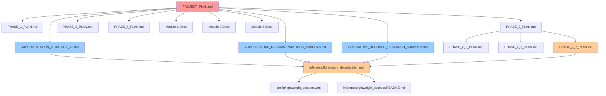

# 📚 DOCUMENTATION INDEX - Project AA

## 3D Cellular Neural Network - Complete Documentation Navigator

**Дата создания:** 6 декабря 2024  
**Версия:** 2.0.0-complete-with-subplans  
**Цель:** Unified access ко всей проектной документации

---

## 🏠 **ГЛАВНЫЕ ПЛАНЫ**

### 📋 **Основные Проектные Документы**

- **[`PROJECT_PLAN.md`](PROJECT_PLAN.md)** - 🎯 **ГЛАВНЫЙ ПЛАН ПРОЕКТА**
  - Общий обзор, прогресс (~78%), модульная архитектура
  - Phase 1-3 статус, ключевые достижения, следующие шаги

### 📋 **Детальные Планы по Фазам**

#### ✅ **Foundation & Core (Завершенные)**

- **[`PHASE_1_PLAN.md`](PHASE_1_PLAN.md)** - ✅ **Foundation (100% завершен)**
  - 3D клеточная архитектура, базовые компоненты
  - Cell Prototype, Lattice3D, Signal Propagation
- **[`PHASE_2_PLAN.md`](PHASE_2_PLAN.md)** - ✅ **Core Functionality (100% завершен)**
  - Teacher LLM Encoder, Data Pipeline, Visualization
  - 8+ LLM models, real-time processing, interactive 3D

#### ✅ **Phase 2 Subplans (Специализированные модули)**

- **[`PHASE_2_3_PLAN.md`](PHASE_2_3_PLAN.md)** - ✅ **EmbeddingReshaper (ЗАВЕРШЕН)**
  - 1D↔3D конвертация с 100% семантическим сохранением
  - Enhanced AdaptiveReshaper, intelligent caching
- **[`PHASE_2_5_PLAN.md`](PHASE_2_5_PLAN.md)** - ✅ **Phrase Architecture (ЗАВЕРШЕН)**
  - Phrase Bank система, биологически обоснованная архитектура
  - Концептуальное мышление вместо токенизации
- **[`PHASE_2_7_PLAN.md`](PHASE_2_7_PLAN.md)** - 🚀 **Lightweight Decoder Implementation (АКТИВНЫЙ)**
  - Module 3: Compact decoder система, революционные архитектуры
  - PhraseBankDecoder (ЗАВЕРШЕН) + GenerativeDecoder (research complete)

#### 💡 **Future Plans (Планируемые)**

- **[`PHASE_3_PLAN.md`](PHASE_3_PLAN.md)** - 💡 **Revolutionary Training Infrastructure**
  - Knowledge Distillation, независимое обучение модулей
  - Autoencoder + dialogue training, cognitive loss functions
- **[`PHASE_4_PLAN.md`](PHASE_4_PLAN.md)** - 💡 **Cognitive Inference System**
  - Production-ready когнитивная система
  - Phrase-level reasoning, биологически правдоподобный вывод

---

## 🧠 **АРХИТЕКТУРНЫЕ ИССЛЕДОВАНИЯ (НОВОЕ - КРИТИЧНО)**

### 🚀 **Revolutionary Architecture Analysis**

- **[`GENERATIVE_DECODER_RESEARCH_SUMMARY.md`](GENERATIVE_DECODER_RESEARCH_SUMMARY.md)** - 🔬 **COMPREHENSIVE RESEARCH**
  - NeoBERT, Phi-4-Mini, modern compact transformers analysis
  - Technical specifications, implementation plan, confidence: 95%
- **[`ARCHITECTURE_RECOMMENDATIONS_ANALYSIS.md`](ARCHITECTURE_RECOMMENDATIONS_ANALYSIS.md)** - 🏆 **TOP-3 SOLUTIONS**
  - Resource-Efficient Transformer (52% memory, 33% speed)
  - Hybrid CCT+Mamba (bio-inspired, O(n) complexity)
  - Enhanced CCT (proven baseline + optimizations)
- **[`IMPLEMENTATION_STRATEGY_V3.md`](IMPLEMENTATION_STRATEGY_V3.md)** - 🚀 **3-PHASE INTEGRATION**
  - Week 1: RET integration, Week 2-3: Hybrid exploration, Week 4: Production
  - Immediate next steps, success metrics, confidence: 99%

---

## 📦 **МОДУЛЬНАЯ ДОКУМЕНТАЦИЯ**

### 🔴 **Module 1: Teacher LLM Encoder** ✅ ЗАВЕРШЕН

- **[`data/embedding_loader/README.md`](data/embedding_loader/README.md)** - Production API
- **[`data/embedding_loader/plan.md`](data/embedding_loader/plan.md)** - Implementation details
- **[`data/embedding_loader/meta.md`](data/embedding_loader/meta.md)** - 8+ LLM models

### 🔵 **Module 2: 3D Cubic Core** ✅ ЗАВЕРШЕН

- **[`core/lattice_3d/README.md`](core/lattice_3d/README.md)** - 3D cellular architecture
- **[`core/embedding_processor/README.md`](core/embedding_processor/README.md)** - 0.999 cosine similarity
- **[`data/embedding_reshaper/README.md`](data/embedding_reshaper/README.md)** - 1D↔3D conversion

### 🟡 **Module 3: Lightweight Decoder** 🚀 STAGE 1 ЗАВЕРШЕН + RESEARCH COMPLETE

- **[`inference/lightweight_decoder/README.md`](inference/lightweight_decoder/README.md)** - 🎯 **PRODUCTION-READY**
- **[`inference/lightweight_decoder/plan.md`](inference/lightweight_decoder/plan.md)** - 📋 **DETAILED IMPLEMENTATION**
  - Stage 1: PhraseBankDecoder (17/17 tests passed)
  - Stage 2: GenerativeDecoder (revolutionary architectures ready)
  - Stage 3: HybridDecoder (planning complete)
- **[`inference/lightweight_decoder/meta.md`](inference/lightweight_decoder/meta.md)** - Technical specs v1.0.0
- **[`inference/lightweight_decoder/errors.md`](inference/lightweight_decoder/errors.md)** - Real development errors
- **[`inference/lightweight_decoder/examples.md`](inference/lightweight_decoder/examples.md)** - 14 production examples
- **[`inference/lightweight_decoder/diagram.mmd`](inference/lightweight_decoder/diagram.mmd)** - Architecture diagram

---

## ⚙️ **КОНФИГУРАЦИЯ & НАСТРОЙКИ**

### 🔧 **Configuration Files**

- **[`config/main_config.yaml`](config/main_config.yaml)** - Main system configuration
- **[`config/lightweight_decoder.yaml`](config/lightweight_decoder.yaml)** - 🚀 **REVOLUTIONARY SETTINGS v3.0.0**
  - Resource-Efficient Transformer configuration
  - Hybrid CCT+Mamba settings
  - Enhanced CCT baseline options
- **[`requirements.txt`](requirements.txt)** - Python dependencies

### 🏗️ **Development Guidelines**

- **[`instructions.md`](instructions.md)** - Complete development instructions
- **[`README.md`](README.md)** - Project overview & quick start

---

## 📊 **ТЕХНИЧЕСКИЕ СПЕЦИФИКАЦИИ**

### 🧪 **Testing & Validation**

- **[`test_lattice_3d_basic.py`](test_lattice_3d_basic.py)** - Core 3D tests
- **[`test_embedding_loader_basic.py`](test_embedding_loader_basic.py)** - LLM integration tests
- **[`inference/lightweight_decoder/`](inference/lightweight_decoder/)** - 17/17 production tests

### 📈 **Performance & Monitoring**

- **[`logs/main.log`](logs/main.log)** - System logs
- **[`demos/`](demos/)** - Working demonstrations
- Performance metrics in module README files

---

## 🎯 **NAVIGATION BY PRIORITY**

### 🚨 **IMMEDIATE ACTION REQUIRED**

1. **[`IMPLEMENTATION_STRATEGY_V3.md`](IMPLEMENTATION_STRATEGY_V3.md)** - Start RET integration
2. **[`ARCHITECTURE_RECOMMENDATIONS_ANALYSIS.md`](ARCHITECTURE_RECOMMENDATIONS_ANALYSIS.md)** - Choose architecture
3. **[`inference/lightweight_decoder/plan.md`](inference/lightweight_decoder/plan.md)** - Stage 2.1 tasks
4. **[`PHASE_2_7_PLAN.md`](PHASE_2_7_PLAN.md)** - Current development focus

### 📋 **CURRENT DEVELOPMENT FOCUS**

1. **[`PROJECT_PLAN.md`](PROJECT_PLAN.md)** - Overall progress tracking
2. **[`GENERATIVE_DECODER_RESEARCH_SUMMARY.md`](GENERATIVE_DECODER_RESEARCH_SUMMARY.md)** - Technical details
3. **[`config/lightweight_decoder.yaml`](config/lightweight_decoder.yaml)** - Configuration updates
4. **[`PHASE_2_7_PLAN.md`](PHASE_2_7_PLAN.md)** - Lightweight Decoder implementation

### 🏆 **COMPLETED ACHIEVEMENTS**

1. **[`inference/lightweight_decoder/README.md`](inference/lightweight_decoder/README.md)** - Production success
2. **[`core/embedding_processor/README.md`](core/embedding_processor/README.md)** - 0.999 quality
3. **[`data/embedding_loader/README.md`](data/embedding_loader/README.md)** - LLM integration
4. **[`PHASE_2_3_PLAN.md`](PHASE_2_3_PLAN.md)** - EmbeddingReshaper success
5. **[`PHASE_2_5_PLAN.md`](PHASE_2_5_PLAN.md)** - Phrase Architecture complete

---

## 🔍 **QUICK SEARCH GUIDE**

### 🔎 **By Topic:**

- **Architecture Research:** `GENERATIVE_DECODER_RESEARCH_SUMMARY.md`, `ARCHITECTURE_RECOMMENDATIONS_ANALYSIS.md`
- **Implementation Plans:** `IMPLEMENTATION_STRATEGY_V3.md`, `inference/lightweight_decoder/plan.md`
- **Phase Plans:** `PHASE_*_PLAN.md` - все основные и подпланы
- **Configuration:** `config/lightweight_decoder.yaml`, `config/main_config.yaml`
- **Module Documentation:** `*/README.md`, `*/plan.md`, `*/meta.md`
- **Production Examples:** `inference/lightweight_decoder/examples.md`

### 🔎 **By Status:**

- **✅ Completed:**
  - Foundation: `PHASE_1_PLAN.md`
  - Core: `PHASE_2_PLAN.md`, `PHASE_2_3_PLAN.md`, `PHASE_2_5_PLAN.md`
  - Module 1 & 2 documentation, Stage 1 Lightweight Decoder
- **🚀 Active:**
  - `PHASE_2_7_PLAN.md` - Lightweight Decoder Implementation
  - GenerativeDecoder research & implementation planning
- **💡 Planned:**
  - `PHASE_3_PLAN.md` - Training infrastructure
  - `PHASE_4_PLAN.md` - Cognitive inference system

### 🔎 **By Urgency:**

- **🚨 Critical:** Revolutionary architecture integration documents
- **📋 Important:** Current module implementation plans, `PHASE_2_7_PLAN.md`
- **📊 Reference:** Technical specifications & completed modules

---

## 📚 **DOCUMENT RELATIONSHIPS**

---

## 📋 **PLANNING HIERARCHY**

### 🏗️ **Main Project Plans**

1. **[`PROJECT_PLAN.md`](PROJECT_PLAN.md)** - 🎯 Master project overview
2. **[`PHASE_1_PLAN.md`](PHASE_1_PLAN.md)** - Foundation (complete)
3. **[`PHASE_2_PLAN.md`](PHASE_2_PLAN.md)** - Core Functionality (complete)
4. **[`PHASE_3_PLAN.md`](PHASE_3_PLAN.md)** - Training Infrastructure (planned)
5. **[`PHASE_4_PLAN.md`](PHASE_4_PLAN.md)** - Cognitive Inference (planned)

### 🔧 **Phase 2 Specialized Subplans**

1. **[`PHASE_2_3_PLAN.md`](PHASE_2_3_PLAN.md)** - EmbeddingReshaper (✅ complete)
2. **[`PHASE_2_5_PLAN.md`](PHASE_2_5_PLAN.md)** - Phrase Architecture (✅ complete)
3. **[`PHASE_2_7_PLAN.md`](PHASE_2_7_PLAN.md)** - Lightweight Decoder (🔄 active)

### 🧠 **Research & Strategy Documents**

1. **[`GENERATIVE_DECODER_RESEARCH_SUMMARY.md`](GENERATIVE_DECODER_RESEARCH_SUMMARY.md)** - Research analysis
2. **[`ARCHITECTURE_RECOMMENDATIONS_ANALYSIS.md`](ARCHITECTURE_RECOMMENDATIONS_ANALYSIS.md)** - Top architectures
3. **[`IMPLEMENTATION_STRATEGY_V3.md`](IMPLEMENTATION_STRATEGY_V3.md)** - Integration strategy

---

**🎯 START HERE:** Если вы новичок в проекте, начните с **[`PROJECT_PLAN.md`](PROJECT_PLAN.md)**, затем **[`IMPLEMENTATION_STRATEGY_V3.md`](IMPLEMENTATION_STRATEGY_V3.md)** для immediate actions.

**🚀 FOR DEVELOPERS:** Focus на **[`PHASE_2_7_PLAN.md`](PHASE_2_7_PLAN.md)** и **[`inference/lightweight_decoder/plan.md`](inference/lightweight_decoder/plan.md)** для current development tasks.

**📊 FOR OVERVIEW:** **[`PROJECT_PLAN.md`](PROJECT_PLAN.md)** содержит complete project status (~78% complete) и next steps.
