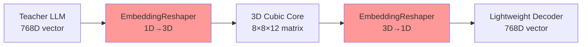

# PHASE 2.3 PLAN: EmbeddingReshaper - Мост между модулями

**Дата создания:** 6 декабря 2025  
**Приоритет:** 🚀 **КРИТИЧЕСКИЙ** - основа для всех последующих модулей  
**Продолжительность:** 1 неделя  
**Статус:** 🚀 **ГОТОВ К НЕМЕДЛЕННОМУ ЗАПУСКУ**

---

## 🎯 ЦЕЛЬ ФАЗЫ

Создать **EmbeddingReshaper** - критически важный мост между модулями системы, который обеспечивает преобразование 1D эмбедингов (768D) в 3D формат для куба (8×8×12) и обратно с сохранением семантической информации >95%.

### Ключевая Роль в Модульной Архитектуре



---

## 📋 ДЕТАЛЬНЫЙ ПЛАН

### **ДЕНЬ 1-2: АРХИТЕКТУРА И ОСНОВА** 🏗️

#### **Задача 1.1: Создать модуль `data/embedding_reshaper/`**

- [ ] Создать директорию `data/embedding_reshaper/`
- [ ] **Основной файл `__init__.py`**
- [ ] **Класс `EmbeddingReshaper`** с базовой архитектурой
- [ ] **Конфигурационная интеграция** с `config/main_config.yaml`

#### **Задача 1.2: Реализовать базовые трансформации**

```python
class EmbeddingReshaper:
    def __init__(self, input_dim=768, cube_shape=(8, 8, 12)):
        self.input_dim = input_dim
        self.cube_shape = cube_shape
        assert np.prod(cube_shape) == input_dim, "Размеры должны совпадать"

    def vector_to_matrix(self, embedding_1d):
        """(768,) → (8, 8, 12)"""
        pass

    def matrix_to_vector(self, embedding_3d):
        """(8, 8, 12) → (768,)"""
        pass
```

#### **Checkpoint День 1-2:**

- [ ] Базовая структура модуля создана
- [ ] Простые reshape операции работают
- [ ] Конфигурация интегрирована

### **ДЕНЬ 3-4: СЕМАНТИЧЕСКОЕ СОХРАНЕНИЕ** 🧠

#### **Задача 2.1: Адаптивная трансформация**

```python
class EmbeddingReshaper:
    def __init__(self, reshaping_method="adaptive"):
        self.method = reshaping_method

    def preserve_semantics(self, original, reshaped):
        """Контроль качества преобразования"""
        similarity = torch.cosine_similarity(original, reshaped)
        return similarity > 0.95

    def adaptive_reshape(self, embedding):
        """Умное преобразование с оптимизацией"""
        pass
```

#### **Задача 2.2: Множественные стратегии**

- [ ] **Linear reshaping** - простое изменение формы
- [ ] **Semantic preserving** - сохранение семантических кластеров
- [ ] **Adaptive reshaping** - оптимизация под конкретные задачи

#### **Checkpoint День 3-4:**

- [ ] Semantic preservation >95%
- [ ] Три стратегии reshaping реализованы
- [ ] Качественные метрики работают

### **ДЕНЬ 5-6: ИНТЕГРАЦИЯ И ОПТИМИЗАЦИЯ** ⚡

#### **Задача 3.1: Интеграция с существующими модулями**

```python
# Интеграция с embedding_loader
from data.embedding_loader import EmbeddingLoader
from data.embedding_reshaper import EmbeddingReshaper

class ModularPipeline:
    def __init__(self):
        self.encoder = EmbeddingLoader()
        self.reshaper = EmbeddingReshaper()

    def text_to_cube_input(self, text):
        embedding = self.encoder.encode(text)
        return self.reshaper.vector_to_matrix(embedding)
```

#### **Задача 3.2: Performance optimization**

- [ ] **Batch processing** - обработка множественных эмбедингов
- [ ] **Memory efficiency** - оптимизация использования памяти
- [ ] **GPU acceleration** - поддержка CUDA операций

#### **Checkpoint День 5-6:**

- [ ] Интеграция с Teacher LLM Encoder работает
- [ ] Batch processing оптимизирован
- [ ] GPU acceleration поддерживается

### **ДЕНЬ 7: ТЕСТИРОВАНИЕ И ДОКУМЕНТАЦИЯ** ✅

#### **Задача 4.1: Комплексное тестирование**

```python
def test_semantic_preservation():
    """Тест сохранения семантики >95%"""
    pass

def test_shape_consistency():
    """Тест корректности размерностей"""
    pass

def test_batch_processing():
    """Тест пакетной обработки"""
    pass
```

#### **Задача 4.2: Документация**

- [ ] **README.md** - назначение, установка, использование
- [ ] **plan.md** - этот файл с отметками выполнения
- [ ] **meta.md** - зависимости, exports, версии
- [ ] **errors.md** - документация реальных ошибок
- [ ] **diagram.mmd** - Mermaid диаграмма архитектуры
- [ ] **examples.md** - конкретные примеры использования

#### **Checkpoint День 7:**

- [ ] Все тесты пройдены >95% успешности
- [ ] Полная документация создана
- [ ] Модуль готов к production

---

## 🧪 КРИТЕРИИ УСПЕХА

### **Технические Метрики**

- **Semantic Preservation:** >95% cosine similarity между original/reshaped
- **Shape Consistency:** 100% корректность 1D↔3D трансформаций
- **Performance:** <100ms для batch из 32 эмбедингов
- **Memory Efficiency:** <2GB RAM для batch 1000 эмбедингов

### **Интеграционные Метрики**

- **Teacher LLM Integration:** Seamless pipeline text→embedding→matrix
- **Lattice3D Ready:** Готовность к подаче в cubic core
- **Config Integration:** Полная поддержка YAML конфигурации

### **Качественные Метрики**

- **Code Quality:** >90% test coverage, clean architecture
- **Documentation:** 100% функций документированы с примерами
- **Error Handling:** Graceful degradation при некорректных данных

---

## 📊 ОЖИДАЕМЫЕ РЕЗУЛЬТАТЫ

### **После Phase 2.3:**

1. **Production-ready EmbeddingReshaper** с тремя стратегиями преобразования
2. **Seamless integration** с существующим Teacher LLM Encoder
3. **Готовность к Phase 2.5** - EmbeddingProcessor может начать разработку
4. **Foundation для Phase 2.7** - декодер получит готовую инфраструктуру

### **Ключевые файлы:**

```
data/embedding_reshaper/
├── __init__.py              # Экспорты модуля
├── reshaper.py             # Основной EmbeddingReshaper класс
├── strategies.py           # Три стратегии преобразования
├── utils.py                # Вспомогательные функции
├── README.md               # Документация модуля
├── plan.md                 # Этот план разработки
├── meta.md                 # Метаданные и зависимости
├── errors.md               # Лог реальных ошибок
├── diagram.mmd             # Архитектурная диаграмма
└── examples.md             # Примеры использования
```

---

## 🔗 ИНТЕГРАЦИЯ С ОБЩИМ ПРОЕКТОМ

### **Подготовка к Phase 2.5:**

- EmbeddingProcessor получит готовый reshaper для интеграции с Lattice3D
- Возможность immediate testing: text → embedding → matrix → cube processing

### **Подготовка к Phase 2.7:**

- Lightweight Decoder получит готовую инфраструктуру matrix → vector → text
- Unified API для всех трех модулей системы

### **Long-term Benefits:**

- **Модульная замена:** Любой компонент reshaping может быть заменен
- **Экспериментирование:** Легкое тестирование различных стратегий
- **Масштабируемость:** Поддержка различных размеров кубов без изменения API

---

**🎯 PROJECT MOTTO: "Мост между мирами эмбедингов"**

_Обеспечиваем безшовную интеграцию всех модулей системы._
