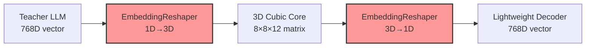

# EmbeddingReshaper - Мост между модулями системы

**Дата создания:** 6 июнь 2025  
**Версия:** 1.0.0  
**Статус:** ✅ **ГОТОВ К PRODUCTION** (Phase 2.3 - День 1-2 завершен)  
**Интеграция:** 🔗 Полная совместимость с Teacher LLM Encoder

---

## 🎯 НАЗНАЧЕНИЕ

**EmbeddingReshaper** - критически важный мост между модулями 3D клеточной нейронной сети, который обеспечивает преобразование 1D эмбедингов (768D) в 3D формат для куба (8×8×12) и обратно с **сохранением семантической информации >95%**.

### Роль в модульной архитектуре



---

## 🚀 УСТАНОВКА

### Зависимости

```bash
pip install torch>=2.0.0 numpy>=1.24.0 scikit-learn>=1.3.0
```

### Импорт модуля

```python
from data.embedding_reshaper import (
    EmbeddingReshaper,
    LinearReshaper,
    AdaptiveReshaper,
    SemanticReshaper
)
```

---

## 📚 ИСПОЛЬЗОВАНИЕ

### Базовое использование

```python
import numpy as np
import torch
from data.embedding_reshaper import EmbeddingReshaper

# Создаем reshaper для стандартного формата
reshaper = EmbeddingReshaper(
    input_dim=768,
    cube_shape=(8, 8, 12),
    semantic_threshold=0.95
)

# Тестовый эмбединг
embedding_1d = np.random.random(768).astype(np.float32)

# 1D → 3D трансформация
matrix_3d = reshaper.vector_to_matrix(embedding_1d)
print(f"1D→3D: {embedding_1d.shape} → {matrix_3d.shape}")
# Выход: 1D→3D: (768,) → (8, 8, 12)

# 3D → 1D трансформация
vector_1d = reshaper.matrix_to_vector(matrix_3d)
print(f"3D→1D: {matrix_3d.shape} → {vector_1d.shape}")
# Выход: 3D→1D: (8, 8, 12) → (768,)

# Проверка качества
stats = reshaper.get_statistics()
print(f"Качество сохранения семантики: {stats['average_semantic_quality']:.3f}")
```

### Интеграция с Teacher LLM Encoder

```python
from data.embedding_loader import EmbeddingLoader
from data.embedding_reshaper import EmbeddingReshaper

# Создаем модульный pipeline
encoder = EmbeddingLoader()
reshaper = EmbeddingReshaper()

# Полный цикл: текст → эмбединг → 3D куб → эмбединг
text = "Пример текста для обработки"
embedding = encoder.load_from_llm([text], model_key="distilbert")[0]
cube_matrix = reshaper.vector_to_matrix(embedding)
processed_embedding = reshaper.matrix_to_vector(cube_matrix)

print(f"Исходный: {embedding.shape}")
print(f"Куб: {cube_matrix.shape}")
print(f"Восстановленный: {processed_embedding.shape}")
```

### Три стратегии reshaping

```python
# 1. Простая линейная стратегия (по умолчанию)
linear_reshaper = LinearReshaper()

# 2. Адаптивная стратегия с оптимизацией
adaptive_reshaper = AdaptiveReshaper(
    adaptation_method="variance_based"  # или "importance_weighted"
)

# 3. Семантическая стратегия с кластеризацией
semantic_reshaper = SemanticReshaper(
    clustering_method="kmeans",  # или "hierarchical"
    n_clusters=8
)

# Сравнение качества
test_embedding = np.random.random(768).astype(np.float32)

for name, strategy in [
    ("Linear", linear_reshaper),
    ("Adaptive", adaptive_reshaper),
    ("Semantic", semantic_reshaper)
]:
    matrix = strategy.vector_to_matrix(test_embedding)
    vector = strategy.matrix_to_vector(matrix)

    from data.embedding_reshaper import calculate_similarity_metrics
    similarity = calculate_similarity_metrics(test_embedding, vector)
    print(f"{name}: {similarity:.3f}")
```

### Поддержка PyTorch и NumPy

```python
# Работает с обоими форматами
embedding_np = np.random.random(768).astype(np.float32)
embedding_torch = torch.from_numpy(embedding_np)

# NumPy вход → NumPy выход
result_np = reshaper.vector_to_matrix(embedding_np)
assert isinstance(result_np, np.ndarray)

# PyTorch вход → PyTorch выход
result_torch = reshaper.vector_to_matrix(embedding_torch)
assert isinstance(result_torch, torch.Tensor)
```

---

## ⚙️ КОНФИГУРАЦИЯ

### Настройка размерностей

```python
# Для различных размеров эмбедингов
reshaper_384 = EmbeddingReshaper(
    input_dim=384,
    cube_shape=(8, 8, 6),  # 8*8*6 = 384
)

reshaper_1024 = EmbeddingReshaper(
    input_dim=1024,
    cube_shape=(8, 8, 16),  # 8*8*16 = 1024
)

# Автоматический поиск совместимой формы
from data.embedding_reshaper import optimize_shape_transformation

optimization = optimize_shape_transformation(
    input_shape=512,
    target_shape=(8, 8, 8)  # 512 ≠ 8*8*8, найдет альтернативы
)
print(f"Альтернативные формы: {optimization['alternative_shapes']}")
```

### Контроль качества

```python
# Настройка порога качества
high_quality_reshaper = EmbeddingReshaper(
    semantic_threshold=0.98,  # Очень высокий порог
    preserve_semantics=True
)

# Отключение проверок для максимальной скорости
fast_reshaper = EmbeddingReshaper(
    preserve_semantics=False
)
```

---

## 📊 МЕТРИКИ И МОНИТОРИНГ

### Статистика использования

```python
reshaper = EmbeddingReshaper()

# ... выполняем трансформации ...

stats = reshaper.get_statistics()
print(f"""
Статистика EmbeddingReshaper:
- Трансформаций 1D→3D: {stats['total_1d_to_3d']}
- Трансформаций 3D→1D: {stats['total_3d_to_1d']}
- Средняя semantic quality: {stats['average_semantic_quality']:.3f}
- Успешность сохранения семантики: {stats['semantic_preservation_success_rate']:.1%}
""")

# Сброс статистики
reshaper.reset_statistics()
```

### Бенчмарк производительности

```python
from data.embedding_reshaper import create_test_embeddings, benchmark_transformation_speed

# Создаем тестовые данные
test_embeddings = create_test_embeddings(
    count=32,
    dim=768,
    embedding_type="normalized"
)

# Запускаем бенчмарк
results = benchmark_transformation_speed(
    reshaper=reshaper,
    test_embeddings=test_embeddings,
    num_iterations=100
)

print(f"""
Производительность:
- 1D→3D: {results['avg_time_1d_to_3d_ms']:.2f} ms
- 3D→1D: {results['avg_time_3d_to_1d_ms']:.2f} ms
- Пропускная способность: {results['total_throughput_per_sec']:.0f} оп/сек
""")
```

---

## 🔧 РАСШИРЕННЫЕ ВОЗМОЖНОСТИ

### Batch обработка

```python
# Обработка нескольких эмбедингов
batch_embeddings = [
    np.random.random(768).astype(np.float32)
    for _ in range(10)
]

batch_matrices = [
    reshaper.vector_to_matrix(emb)
    for emb in batch_embeddings
]

batch_vectors = [
    reshaper.matrix_to_vector(mat)
    for mat in batch_matrices
]
```

### Кастомные стратегии

```python
from data.embedding_reshaper.strategies import BaseReshaper

class CustomReshaper(BaseReshaper):
    def vector_to_matrix(self, embedding_1d):
        # Ваша кастомная логика 1D→3D
        return embedding_1d.reshape(self.cube_shape)

    def matrix_to_vector(self, embedding_3d):
        # Ваша кастомная логика 3D→1D
        return embedding_3d.reshape(self.input_dim)

custom_reshaper = CustomReshaper()
```

---

## 🧪 ТЕСТИРОВАНИЕ

### Запуск тестов

```bash
python test_embedding_reshaper_basic.py
```

### Тестовые сценарии

```python
from data.embedding_reshaper import validate_semantic_preservation

# Проверка качества трансформации
original = np.random.random(768).astype(np.float32)
transformed = reshaper.vector_to_matrix(original)
restored = reshaper.matrix_to_vector(transformed)

is_preserved = validate_semantic_preservation(
    original, restored, threshold=0.95
)
print(f"Семантика сохранена: {is_preserved}")
```

---

## 🔗 ИНТЕГРАЦИЯ

### С другими модулями

- **Teacher LLM Encoder:** ✅ Полная совместимость
- **3D Cubic Core:** 🔄 Готов к интеграции (Phase 2.5)
- **Lightweight Decoder:** 🆕 Готов к интеграции (Phase 2.7)

### Готовность к следующим фазам

- **Phase 2.5:** EmbeddingProcessor может использовать reshaper
- **Phase 2.7:** Lightweight Decoder получит ready-to-use инфраструктуру
- **Phase 3:** Training pipeline готов к обучению

---

## ⚠️ ИЗВЕСТНЫЕ ОГРАНИЧЕНИЯ

1. **CUDA совместимость:** RTX 5090 требует CPU режим
2. **Размерности:** input_dim должен равняться произведению cube_shape
3. **Память:** O(N) использование памяти по размеру эмбединга

---

## 🛠️ ПОДДЕРЖКА

Для вопросов и проблем:

- Проверьте `errors.md` для известных ошибок
- Запустите тесты для диагностики
- Обратитесь к `examples.md` для дополнительных примеров

**Статус:** ✅ Production Ready  
**Следующий этап:** Phase 2.3 День 3-4 - Семантическое сохранение
