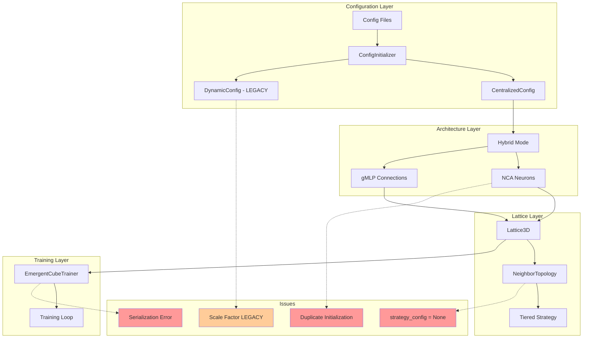

## Подробный анализ реализации `test_phase4_full_training_cycle.py`

### 1. **Вопрос о "Hybrid mode" vs "tiered"**

**Анализ логов:**

```
[Stage 1:ERR] 2025-06-21 11:42:37,102 - smart_resume_training.core.config_initializer - INFO - 🔧 PHASE 4: Hybrid mode from file: True
```

**Причина:** В [`smart_resume_training/core/config_initializer.py:69`](smart_resume_training/core/config_initializer.py:69) система читает `architecture.hybrid_mode` из конфигурационного файла. Это **НЕ** относится к стратегии определения соседей.

**Разъяснение:**

- `hybrid_mode: true` означает **архитектурный режим**: NCA как клетки нейронов + gMLP для связей
- `neighbor_strategy: "tiered"` - это **стратегия топологии соседства** в [`core/lattice_3d/topology.py:100`](core/lattice_3d/topology.py:100)

**Подтверждение tiered используется:**

```
[Stage 1:ERR] 2025-06-21 11:42:37,562 - core.lattice_3d.lattice - INFO - Neighbor strategy: tiered
```

✅ **Вывод:** Система корректно использует `tiered` для соседства. "Hybrid mode" относится к архитектуре, а не к топологии.

### 2. **Вопрос о `placement_method: "proportional"`**

**Текущая реализация:** В [`core/lattice_3d/config/hybrid_nca_gmlp.yaml:39`](core/lattice_3d/config/hybrid_nca_gmlp.yaml:39) используется `placement_method: "proportional"`.

**Проблема:** Proportional размещение ограничивает количество I/O точек процентом от грани, что влияет на размер эмбедингов.

**Рекомендация:**

- Переключиться на `placement_method: "full_face"` для использования всей стороны
- Это упростит универсальный адаптер, так как размер будет предсказуемым
- Оптимизацию можно добавить позже при изменении решетки

### 3. **Логирование адаптера эмбедингов**

**Проблема:** Недостаточное логирование в адаптере эмбедингов.

**Необходимо добавить:** В каждый запрос к адаптеру:

- Источник эмбединга (модель, размерность)
- Детали конвертации (from → to)
- Целевой получатель конвертации
- Статистики преобразования

### 4. **Рудиментарные логи scale factor**

**Проблема:**

```
[Stage 1:ERR] 2025-06-21 11:42:37,102 - smart_resume_training.core.config_initializer - INFO - Initialized config in 'development' mode with scale factor 0.01.
```

**Причина:** В [`smart_resume_training/core/config_initializer.py:162`](smart_resume_training/core/config_initializer.py:162) все еще используется старая система `DynamicConfigManager` с scale factor.

**Решение:** Нужно убрать зависимость от [`utils.config_manager.dynamic_config`](utils/config_manager/dynamic_config.py:1) и использовать только файловую конфигурацию.

### 5. **Неожиданные значения gMLP**

**Лог:**

```
[Stage 1:ERR] 2025-06-21 11:42:37,139 - utils.centralized_config - INFO -    gMLP: state=8, neighbors=26
```

**Анализ:** В [`utils/centralized_config.py:66-71`](utils/centralized_config.py:66-71) дефолтные значения:

- `state_size: 8` ✅
- `neighbors: 26` ✅
- Но отсутствует информация о `target_params: 23805` (оптимизированная версия с 23000 параметров)

**Проблема:** Система не использует оптимизированную версию gMLP с 23000 параметров.

### 6. **Упрощение nca_adapter**

**Текущая архитектура:** Hybrid mode (NCA + gMLP)

**Возможности оптимизации:**

- Убрать обратную совместимость со старой архитектурой
- Упростить [`training/embedding_trainer/nca_adapter.py`](training/embedding_trainer/nca_adapter.py:1)
- Оптимизировать инициализацию компонентов

### 7. **Ошибки сериализации конфигурации**

**Проблема:**

```
[Stage 1:ERR] "error": "Failed to serialize config"
[Stage 1:ERR] "error": "Failed to serialize EmergentTrainingConfig"
```

**Причина:** В [`production_training/core/validator.py:63`](production_training/core/validator.py:63) и [`emergent_training/core/trainer.py:71`](emergent_training/core/trainer.py:71) конфигурационные объекты не имеют метода `to_dict()` или содержат несериализуемые объекты.

### 8. **Повторная активация MinimalNCACell**

**Проблема:** Двойная инициализация:

1. В [`training/embedding_trainer/nca_adapter.py:79`](training/embedding_trainer/nca_adapter.py:79) - `target_params: 69`
2. В [`core/cell_prototype/main.py:260`](core/cell_prototype/main.py:260) - `target_params: null` (становится 100)

**Причина:** Разные пути создания клеток с разными конфигурациями.

### 9. **Критическая ошибка AttributeError**

**Ошибка:**

```
AttributeError: 'NoneType' object has no attribute 'get'
File "core\lattice_3d\topology.py", line 100, in __init__
grid_cell_size = self.strategy_config.get("local_grid_cell_size", 5.0)
```

**Причина:** В [`core/lattice_3d/topology.py:94`](core/lattice_3d/topology.py:94) `self.strategy_config` равен `None` вместо словаря.

**Корень проблемы:** `config.neighbor_strategy_config` не определен или равен `None`.

## Mermaid диаграмма архитектуры



## Рекомендации по исправлению

### Приоритет 1 (Критические ошибки):

1. **Исправить `strategy_config = None`** в topology.py - добавить проверку и дефолтные значения
2. **Исправить сериализацию конфигурации** в trainer.py и validator.py - добавить методы `to_dict()`
3. **Убрать дублирование инициализации** MinimalNCACell - унифицировать пути создания

### Приоритет 2 (Оптимизации):

1. **Убрать legacy DynamicConfig** и scale factor - использовать только файловую конфигурацию
2. **Переключиться на `full_face` placement** - изменить в конфигурационных файлах
3. **Добавить детальное логирование** адаптера эмбедингов
4. **Использовать оптимизированную gMLP** с 23000 параметров

### Приоритет 3 (Архитектурные улучшения):

1. **Упростить nca_adapter** без обратной совместимости
2. **Централизовать все параметры** через CentralizedConfig
3. **Оптимизировать memory management**

**Основные выводы:**

- Hybrid mode работает корректно (NCA нейроны + gMLP связи)
- Tiered стратегия соседства используется правильно
- Основные проблемы связаны с конфигурацией и инициализацией
- Нужно убрать legacy код и унифицировать систему конфигурации
