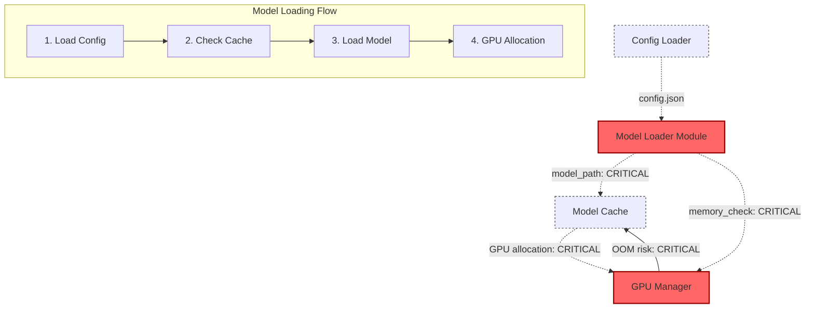
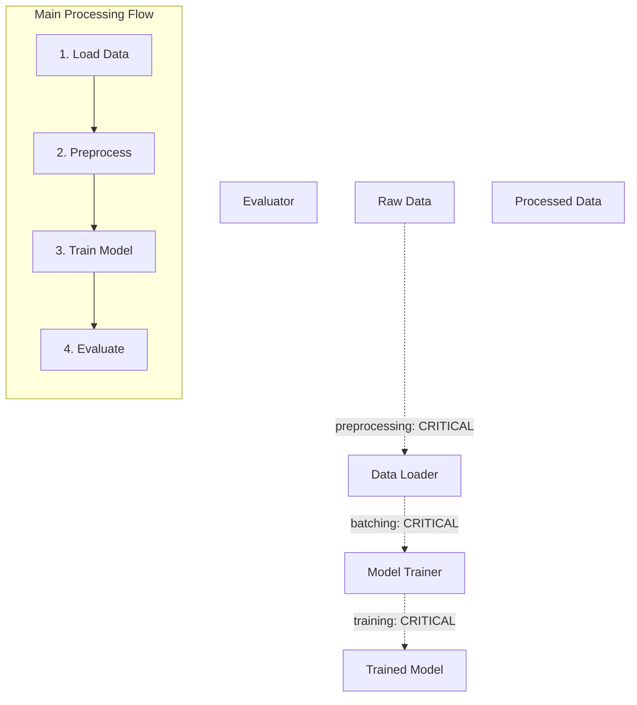

# LLM Project Collaboration Guidelines

## Key Principles for this Research Project

1. **Extreme Modularity**: Create extremely small, focused modules - even smaller than might seem practical in conventional development. See `Implementation Guidelines` below for examples.
2. **NO AUTOMATED TESTING**: Testing is done ONLY manually by running the application and verifying functionality directly.
3. **Documentation-First Approach**: After each implementation step, immediately update all relevant documentation. See `Documentation Requirements` and `@.cursor/rules/documentation-guidelines.mdc` for details.
4. **Incremental Development**: Implement in tiny steps with frequent verification of functionality. Mark progress in `plan.md`.
5. **Minimal Changes Only**: Make only the absolute minimum changes needed to get a feature working for testing.
6. **Document Only Real Errors**: Only document errors that were actually encountered, not hypothetical ones. See `@.cursor/rules/documentation-guidelines.mdc`.
7. **Stop After Minimal Implementation**: After implementing minimal changes to make a feature testable, stop and wait for further user instructions.
   7.1 After user confirmed successful testing, you can move on to full implementation of the feature
8. **Unified Application Interface**: Build a cohesive application with a central interface that incrementally grows as new modules are added.
9. **Proper Code Organization & Separation**: Maintain modularity and separation of concerns by keeping different components in separate files within modules. See guidelines for specific file types (`@.cursor/rules/python-guidelines.mdc`, `@.cursor/rules/data-guidelines.mdc`, `@.cursor/rules/config-guidelines.mdc`).
10. **Comprehensive Operation Feedback**: Provide detailed feedback in both console/logs and output for all operations. See `@.cursor/rules/python-guidelines.mdc`.

## Effective Use of Auxiliary Files for Code Analysis

When analyzing code to understand functionality or diagnose issues, follow this systematic approach using the project's auxiliary documentation:

1. **Start with Mermaid Diagrams (diagram.mmd)**:

   - Begin with the root project diagram to understand where the module fits in the larger system
   - Look at the module-specific diagram to identify its components, relationships, and data flows
   - Pay special attention to arrows between components which show dependencies and data flow direction
   - Use the diagrams to identify which other modules might be involved in the issue
   - Review data flow paths marked with dashed lines to understand processing sequences
   - Examine critical paths marked with bold/red lines that are common error sources

2. **Review the Module's README.md**:

   - Understand the module's purpose and core functionality
   - Note key APIs and how they should be used
   - Check for recent updates or known limitations

3. **Check errors.md for Known Issues**:

   - Look for previously encountered and solved problems that might be related
   - Check if there are documented workarounds or fixes for similar issues
   - Use past error patterns to understand common failure points
   - Review model training/inference errors specifically tagged with [MODEL-ERROR]

4. **Examine the plan.md File**:

   - See which features have been implemented (checked items)
   - Identify any related features that haven't been implemented yet
   - Understand the intended implementation sequence

5. **Review meta.md for Dependencies**:

   - Check which modules this one depends on
   - Note which modules depend on this one
   - Identify external dependencies (PyTorch, transformers, etc.) that might be relevant
   - Verify data dependencies listed in the data-dependencies section

6. **Look at examples.md for Usage Patterns**:

   - See how the module is intended to be used
   - Understand typical processing patterns
   - Compare actual usage in code with documented examples
   - Review documented training/inference workflows

7. **Cross-Reference with Code**:

   - After reviewing auxiliary files, examine the actual code with context
   - Compare documented interfaces with actual implementations
   - Look for discrepancies between documentation and code
   - Check model configurations against documented parameters

8. **Use Diagrams for Debugging Flow**:
   - During debugging, trace the issue through the flow shown in the diagrams
   - Identify where in the documented flow the issue might be occurring
   - Look for missing connections or incorrect relationships
   - Follow data processing paths to identify where the sequence breaks

This systematic approach helps:

- Avoid reviewing all code blindly
- Focus on the most relevant modules first
- Understand dependencies before changing code
- Identify architecture-level issues more quickly
- Maintain consistency between code and documentation
- Detect model training and inference issues efficiently

When fixing issues, update all relevant documentation to reflect the changes, especially marking solved issues in errors.md and updating diagram.mmd if component relationships change.

## Enhanced Mermaid Diagrams for Model/Data Flow Debugging

To improve error detection and debugging, all module diagrams should be extended to include:

1. **Data Flow Representation**:

   - Use dashed lines with data format names to show data transformation
   - Include data validation steps with their respective components
   - Indicate data preprocessing with nested boxes
   - Example notation: `RawData -.->|tokenization| ProcessedData`

2. **Model Processing Sequences**:

   - Add numbered sequences showing expected model processing flows
   - Use swimlane diagrams for complex model interactions
   - Document expected state changes at each processing step
   - Example: `1. Load model -> 2. Preprocess data -> 3. Run inference -> 4. Post-process results`

3. **Critical Path Highlighting**:
   - Mark error-prone paths with bold red lines or [CRITICAL] tags
   - Highlight memory-intensive operations or GPU bottlenecks
   - Indicate validation points where errors often occur
   - Document recovery paths for error conditions

Example enhanced diagram section for model-loader module:



For the main application diagram, include a complete data processing flow that shows all key transformation paths:



## Data Flow Debugging Benefits

Using the enhanced diagrams for error detection provides these benefits:

1. **Faster Issue Localization**:

   - Easily identify where in the processing flow an error occurs
   - Pinpoint specific data transformations that might be failing
   - See the entire data processing context around an error

2. **Complete Context Understanding**:

   - Visualize both the code execution path and data flow simultaneously
   - Identify gaps between expected and actual data formats
   - Document the full sequence of operations leading to errors

3. **Critical Path Awareness**:

   - Highlight the most error-prone areas for focused testing
   - Identify memory-intensive operations that commonly fail
   - Prioritize debugging efforts on critical data paths

4. **Improved Error Documentation**:
   - Reference specific points in the processing flow in error reports
   - Document expected vs. actual data shapes/formats with diagram references
   - Include error recovery paths in both code and diagrams

## Common Model/Data Processing Problem Patterns

When debugging, specifically check for these common patterns:

1. **Data Shape Issues**:

   - Tensor dimension mismatches between model layers
   - Batch size inconsistencies during processing
   - Data type conflicts (float32 vs float16)

2. **Memory Management**:

   - GPU memory overflow during training/inference
   - Memory leaks in data loading pipelines
   - Inefficient memory usage in large model loading

3. **Model Configuration Errors**:

   - Incorrect hyperparameters for model architecture
   - Mismatched tokenizer and model configurations
   - Version conflicts between model and framework

4. **Asynchronous Processing Failures**:
   - Data loading bottlenecks affecting training speed
   - Race conditions in multi-GPU training
   - Failed error handling during async data processing

For each error found, document in errors.md with these sections:

- Processing sequence that triggered the error
- Error symptoms (stack trace, memory usage, etc.)
- Model/data configuration at time of error
- Root cause analysis
- Solution implemented
- Prevention strategy

When analyzing errors, always check if data processing follows the documented sequence flows in the enhanced diagrams to quickly identify deviation points.

## Module Integration without Code Duplication

To avoid duplicating code between modules and the main application, we use a Python package structure approach:

### Core Integration Principles

1. **No Code Duplication**: Module code stays in their original locations
2. **Package Structure**: Each module is a proper Python package with `__init__.py`
3. **Dynamic Imports**: Modules are imported at runtime using standard Python imports
4. **Shared Configuration**: Configuration files are shared through a central config module

### Integration Process for New Modules

When adding a new module to the application:

1. Create the module with its standard directory structure including `__init__.py`
2. In `main.py`, add the module import:
   ```python
   from modules.new_module import NewModule
   ```
3. In `config/modules.yaml`, add the module configuration:
   ```yaml
   modules:
     new_module:
       enabled: true
       config_path: "config/new_module.yaml"
   ```
4. Create module-specific configuration file if needed
5. Add the module's processing components to the appropriate pipeline in the main application

Detailed documentation is available in `docs/module-integration-guide.md`.

## Directory Structure

Each module, no matter how small, should follow this structure (enforced by `@.cursor/rules/project-guidelines.mdc`):

```
module_name/
├── __init__.py       # Module initialization and exports
├── main.py           # Main module code
├── config/           # Module-specific configuration
│   └── config.yaml
├── data/            # Module-specific data files
│   └── README.md    # Data description
├── utils/           # Module utilities
│   └── helpers.py
├── README.md        # Module overview and usage
├── plan.md          # Implementation plan with checkmarks
├── meta.md          # Metadata about the module
├── errors.md        # Known errors and their solutions
├── diagram.mmd      # Mermaid diagram with module relationships
├── examples.md      # Usage examples
└── requirements.txt # Module-specific dependencies
```

## Documentation Requirements

Maintaining comprehensive and up-to-date documentation is critical. After **EACH** implementation step or code change, all relevant documentation files within the module must be updated immediately.

Refer to `@.cursor/rules/documentation-guidelines.mdc` for the specific list of required files, their expected content, and detailed update procedures, especially for diagrams (`.mmd`) and error logs (`errors.md`).

## Implementation Guidelines

1. **Extreme Granularity**

   - Break down features into the smallest possible functional units.
   - Create separate modules even for simple, distinct functionalities.
   - _Example_: Instead of one large "ModelTrainer" module, create separate modules for `data-loader/`, `model-config/`, `training-loop/`, `checkpointing/`, `evaluation/`, etc.

2. **Verification Checkpoints**

   - After implementing each small unit, manually verify it works by running the application.
   - Do NOT move to the next step until the current functionality is confirmed.
   - Stop after the minimal implementation that allows manual testing and await further instructions.

3. **No Premature Optimization**

   - Prioritize clarity, modularity, and adherence to the documentation structure over performance optimization.

4. **Error Documentation**

   - Document only errors actually encountered during development in `errors.md`. Include cause, solution, and prevention steps. See `@.cursor/rules/documentation-guidelines.mdc` for structure.

5. **Progressive Interface Development**

   - Build a single, unified application interface (`main.py`) that incorporates processing components from different modules. Avoid creating separate, isolated interfaces for each module.

6. **Configuration Management**

   - Extract all configuration into separate `.yaml` files within the module's `config` directory. Avoid hardcoded values. Refer to `@.cursor/rules/config-guidelines.mdc` for specific rules.

7. **Python Code Organization**

   - Structure code logically with clear separation of concerns. Use proper Python packaging with `__init__.py` files. Export clear interfaces. Refer to `@.cursor/rules/python-guidelines.mdc` for specific rules.

8. **Comprehensive Feedback System**

   - Implement detailed logging for all operations (start, progress, success, failure). Use Python's logging module for consistent output. Specific requirements are outlined in the relevant file type rules.

## Communication with LLM

When requesting work on modules:

1. **Be Extremely Specific**:

   ```
   I want to implement the data preprocessing function in the data-loader module.
   ```

2. **Provide Full Context**:

   ```
   This module will be used by the model-trainer module. It should handle
   tokenization and tensor creation for transformer models.
   ```

3. **Request Documentation Updates**:
   ```
   After implementing this, please update the plan.md, meta.md, and diagram.mmd files.
   ```

---

This approach prioritizes extremely fine-grained modularity and documentation over conventional development practices, as the primary goal is to research LLM-assisted development patterns for ML/AI projects.
