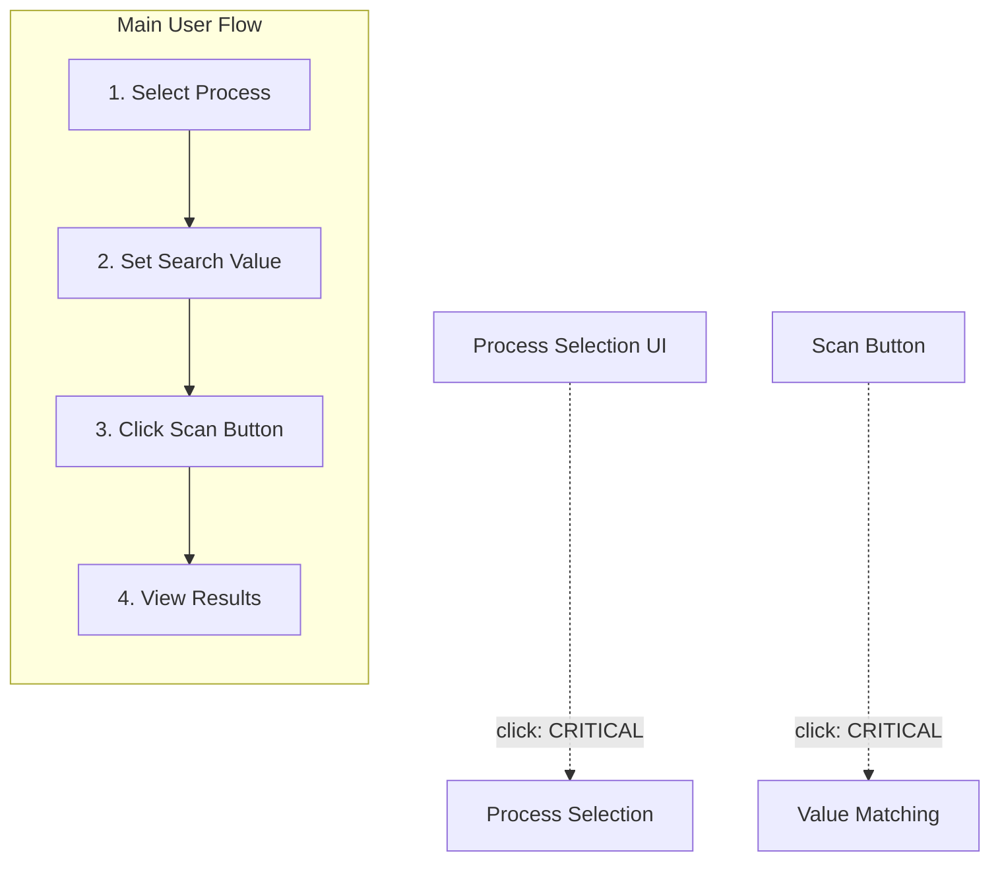

# LLM Project Collaboration Guidelines

## Key Principles for this Research Project

1. **Extreme Modularity**: Create extremely small, focused modules - even smaller than might seem practical in conventional development. See `Implementation Guidelines` below for examples.
2. **NO AUTOMATED TESTING**: Testing is done ONLY manually by running the application and verifying functionality directly.
3. **Documentation-First Approach**: After each implementation step, immediately update all relevant documentation. See `Documentation Requirements` and `@.cursor/rules/documentation-guidelines.mdc` for details.
4. **Incremental Development**: Implement in tiny steps with frequent verification of functionality. Mark progress in `plan.md`.
5. **Minimal Changes Only**: Make only the absolute minimum changes needed to get a feature working for testing.
6. **Document Only Real Errors**: Only document errors that were actually encountered, not hypothetical ones. See `@.cursor/rules/documentation-guidelines.mdc`.
7. **Stop After Minimal Implementation**: After implementing minimal changes to make a feature testable, stop and wait for further user instructions.
   7.1 After successful testing, you can move on to full implementation of the feature
8. **Unified Application Interface**: Build a cohesive application with a central interface that incrementally grows as new modules are added.
9. **Proper Code Organization & Separation**: Maintain modularity and separation of concerns by keeping styles, scripts, and markup in separate files within modules. See guidelines for specific file types (`@.cursor/rules/javascript-guidelines.mdc`, `@.cursor/rules/styling-guidelines.mdc`, `@.cursor/rules/html-guidelines.mdc`).
10. **Comprehensive Operation Feedback**: Provide detailed feedback in both console and UI for all operations. See `@.cursor/rules/javascript-guidelines.mdc` and `@.cursor/rules/html-guidelines.mdc`.

## Effective Use of Auxiliary Files for Code Analysis

When analyzing code to understand functionality or diagnose issues, follow this systematic approach using the project's auxiliary documentation:

1. **Start with Mermaid Diagrams (diagram.mmd)**:

   - Begin with the root project diagram to understand where the module fits in the larger system
   - Look at the module-specific diagram to identify its components, relationships, and data flows
   - Pay special attention to arrows between components which show dependencies and data flow direction
   - Use the diagrams to identify which other modules might be involved in the issue
   - Review event flow paths marked with dashed lines to understand user interaction sequences
   - Examine critical paths marked with bold/red lines that are common error sources

2. **Review the Module's README.md**:

   - Understand the module's purpose and core functionality
   - Note key APIs and how they should be used
   - Check for recent updates or known limitations

3. **Check errors.md for Known Issues**:

   - Look for previously encountered and solved problems that might be related
   - Check if there are documented workarounds or fixes for similar issues
   - Use past error patterns to understand common failure points
   - Review user interaction errors specifically tagged with [UI-ERROR]

4. **Examine the plan.md File**:

   - See which features have been implemented (checked items)
   - Identify any related features that haven't been implemented yet
   - Understand the intended implementation sequence

5. **Review meta.md for Dependencies**:

   - Check which modules this one depends on
   - Note which modules depend on this one
   - Identify external dependencies that might be relevant
   - Verify DOM element dependencies listed in the UI-dependencies section

6. **Look at examples.md for Usage Patterns**:

   - See how the module is intended to be used
   - Understand typical interaction patterns
   - Compare actual usage in code with documented examples
   - Review documented user interaction sequences

7. **Cross-Reference with Code**:

   - After reviewing auxiliary files, examine the actual code with context
   - Compare documented interfaces with actual implementations
   - Look for discrepancies between documentation and code
   - Check event listeners against documented event flow

8. **Use Diagrams for Debugging Flow**:
   - During debugging, trace the issue through the flow shown in the diagrams
   - Identify where in the documented flow the issue might be occurring
   - Look for missing connections or incorrect relationships
   - Follow user interaction paths to identify where the sequence breaks

This systematic approach helps:

- Avoid reviewing all code blindly
- Focus on the most relevant modules first
- Understand dependencies before changing code
- Identify architecture-level issues more quickly
- Maintain consistency between code and documentation
- Detect event-handling and user interaction issues efficiently

When fixing issues, update all relevant documentation to reflect the changes, especially marking solved issues in errors.md and updating diagram.mmd if component relationships change.

## Enhanced Mermaid Diagrams for UI Interaction Debugging

To improve error detection and debugging, all module diagrams should be extended to include:

1. **DOM Event Flow Representation**:

   - Use dashed lines with event names to show event propagation
   - Include event listeners with their respective DOM elements
   - Indicate event delegation with nested boxes
   - Example notation: `ElementA -.->|click| HandlerFunction`

2. **User Interaction Sequences**:

   - Add numbered sequences showing expected user interaction flows
   - Use swimlane diagrams for complex UI interactions
   - Document expected state changes at each interaction step
   - Example: `1. User clicks button -> 2. Dialog opens -> 3. Form submits`

3. **Critical Path Highlighting**:
   - Mark error-prone paths with bold red lines or [CRITICAL] tags
   - Highlight race conditions or timing-dependent operations
   - Indicate validation points where errors often occur
   - Document recovery paths for error conditions

Example enhanced diagram section for process-selection module:

```mermaid
graph TD
    %% Process Selection Module Diagram Core
    ProcessSelection[Process Selection Module]
    FilterInput[Filter Input Element]
    FilterBtn[Filter Button]
    RefreshBtn[Refresh Button]
    SelectBtn[Select Process Button]

    %% DOM Event Flow with dashed lines
    FilterInput -.->|keyup:Enter| FetchProcesses[fetchProcesses()]
    FilterBtn -.->|click| FetchProcesses
    RefreshBtn -.->|click| ClearAndFetch[Clear Filter + fetchProcesses()]
    SelectBtn -.->|click: CRITICAL| SelectProcess[selectProcess()]

    %% User Interaction Sequence
    subgraph "User Interaction Flow"
        direction LR
        U1[1. Load Page] --> U2[2. Filter Processes]
        U2 --> U3[3. Click Select Button]
        U3 --> U4[4. Process Selection Updates]
    end

    %% Critical Path Highlighting
    SelectBtn -.->|click: CRITICAL| SelectProcess
    SelectProcess -->|API call: CRITICAL| Backend

    %% Styling
    classDef critical fill:#f66,stroke:#900,stroke-width:2px;
    classDef event stroke:#333,stroke-width:1px,stroke-dasharray: 3 3;
    class SelectBtn,SelectProcess critical;
    class FilterInput,FilterBtn,RefreshBtn event;
```

For the main application diagram, include a complete user flow representation that shows all key interaction paths:



## Event Flow Debugging Benefits

Using the enhanced diagrams for error detection provides these benefits:

1. **Faster Issue Localization**:

   - Easily identify where in the interaction flow an error occurs
   - Pinpoint specific DOM events that might be failing
   - See the entire user interaction context around an error

2. **Complete Context Understanding**:

   - Visualize both the code execution path and user interaction flow simultaneously
   - Identify gaps between expected and actual behavior
   - Document the full sequence of events leading to errors

3. **Critical Path Awareness**:

   - Highlight the most error-prone areas for focused testing
   - Identify async operations that commonly fail
   - Prioritize debugging efforts on critical user paths

4. **Improved Error Documentation**:
   - Reference specific points in the interaction flow in error reports
   - Document expected vs. actual behavior with diagram references
   - Include error recovery paths in both code and diagrams

## Common UI Interaction Problem Patterns

When debugging, specifically check for these common UI-related error patterns:

1. **Event Timing Issues**:

   - Race conditions between UI updates and data loading
   - Event handlers fired before DOM is fully ready
   - Multiple rapid user interactions causing state conflicts

2. **DOM Element Availability**:

   - Elements referenced before they exist in the DOM
   - Dynamic elements removed while being accessed
   - ID conflicts between modules sharing the DOM

3. **Data Flow Disruptions**:

   - Incomplete data propagation between modules
   - Inconsistent state updates after user interactions
   - Form data not properly validated before processing

4. **Asynchronous Operation Failures**:
   - Promises not properly handled in UI interactions
   - Missing loading states during async operations
   - Failed error handling during async UI updates

For each error found, document in errors.md with these sections:

- Interaction sequence that triggered the error
- Visual symptoms in the UI
- Console errors (if any)
- Root cause analysis
- Solution implemented
- Prevention strategy

When analyzing errors, always check if user interactions follow the documented sequence flows in the enhanced diagrams to quickly identify deviation points.

## Module Integration without Code Duplication

To avoid duplicating code between modules and the main application, we use a dynamic module loading approach:

### Core Integration Principles

1. **No Code Duplication**: Module assets (JS, CSS, HTML) stay in their original locations
2. **Direct Serving**: Express serves module assets directly via static middleware
3. **Dynamic Loading**: JavaScript is loaded at runtime using a module loader
4. **Direct CSS References**: CSS files are referenced directly from module locations

### Integration Process for New Modules

When adding a new module to the application:

1. Create the module with its standard directory structure
2. In `app.js`, add Express static middleware:
   ```javascript
   app.use(
     "/modules/new-module",
     express.static(path.join(__dirname, "../new-module/public"))
   );
   ```
3. In `modules-loader.js`, add the module to the loading list:
   ```javascript
   {
     name: 'new-module',
     scripts: ['js/new-module.js']
   }
   ```
4. In `app/public/index.html`, reference CSS directly:
   ```html
   <link rel="stylesheet" href="/modules/new-module/css/new-module.css" />
   ```
5. Add the module's UI components to the appropriate tab in the main application layout

Detailed documentation is available in `app/module-integration-guide.md`.

## Directory Structure

Each module, no matter how small, should follow this structure (enforced by `@.cursor/rules/project-guidelines.mdc`):

```
module_name/
├── index.js          # Main code file
├── public/           # UI assets
│   ├── index.html    # Module UI template
│   ├── css/          # Module-specific styles
│   │   └── styles.css
│   └── js/           # Module-specific scripts
│       └── main.js
├── README.md         # Module overview and usage
├── plan.md           # Implementation plan with checkmarks
├── meta.md           # Metadata about the module
├── errors.md         # Known errors and their solutions
├── diagram.mmd       # Mermaid diagram with module relationships
└── examples.md       # Usage examples
```

## Documentation Requirements

Maintaining comprehensive and up-to-date documentation is critical. After **EACH** implementation step or code change, all relevant documentation files within the module must be updated immediately.

Refer to `@.cursor/rules/documentation-guidelines.mdc` for the specific list of required files, their expected content, and detailed update procedures, especially for diagrams (`.mmd`) and error logs (`errors.md`).

## Implementation Guidelines

1. **Extreme Granularity**

   - Break down features into the smallest possible functional units.
   - Create separate modules even for simple, distinct functionalities.
   - _Example_: Instead of one large "Scanner" module, create separate modules for `value-input/`, `address-range/`, `scan-execution/`, `results-storage/`, etc.

2. **Verification Checkpoints**

   - After implementing each small unit, manually verify it works by running the application.
   - Do NOT move to the next step until the current functionality is confirmed.
   - Stop after the minimal implementation that allows manual testing and await further instructions.

3. **No Premature Optimization**

   - Prioritize clarity, modularity, and adherence to the documentation structure over performance optimization.

4. **Error Documentation**

   - Document only errors actually encountered during development in `errors.md`. Include cause, solution, and prevention steps. See `@.cursor/rules/documentation-guidelines.mdc` for structure.

5. **Progressive Interface Development**

   - Build a single, unified application interface (`app/public/index.html`) that incorporates UI elements from different modules. Avoid creating separate, isolated interfaces for each module.

6. **Style Management**

   - Extract all CSS styles into separate `.css` files within the module's `public/css` directory. Avoid inline styles. Refer to `@.cursor/rules/styling-guidelines.mdc` for specific rules.

7. **JavaScript Organization**

   - Place all JavaScript code in separate `.js` files (e.g., `index.js`, `public/js/main.js`). Avoid inline scripts. Structure code logically and export clear interfaces. Refer to `@.cursor/rules/javascript-guidelines.mdc` for specific rules.

8. **Comprehensive Feedback System**

   - Implement dual feedback (console logs for developers, UI notifications for users) for all operations (start, progress, success, failure). Ensure messages are informative. Specific requirements are outlined in the relevant file type rules.

## Communication with LLM

When requesting work on modules:

1. **Be Extremely Specific**:

   ```
   I want to implement the address input field in the address-range module.
   ```

2. **Provide Full Context**:

   ```
   This module will be used by the scan-execution module. It should validate
   that addresses are in hexadecimal format.
   ```

3. **Request Documentation Updates**:
   ```
   After implementing this, please update the plan.md, meta.md, and diagram.mmd files.
   ```

---

This approach prioritizes extremely fine-grained modularity and documentation over conventional development practices, as the primary goal is to research LLM-assisted development patterns.
